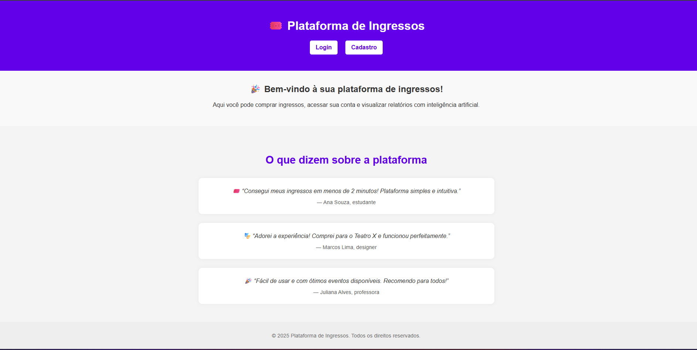
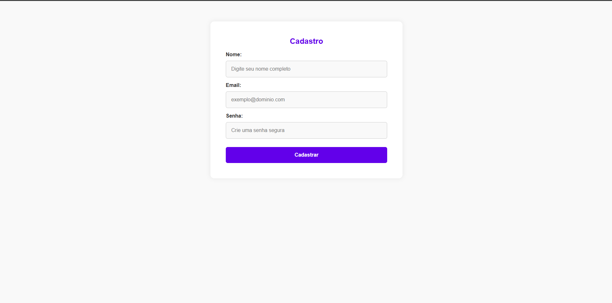
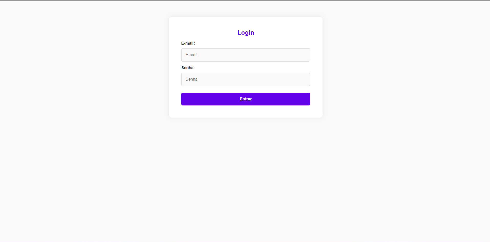
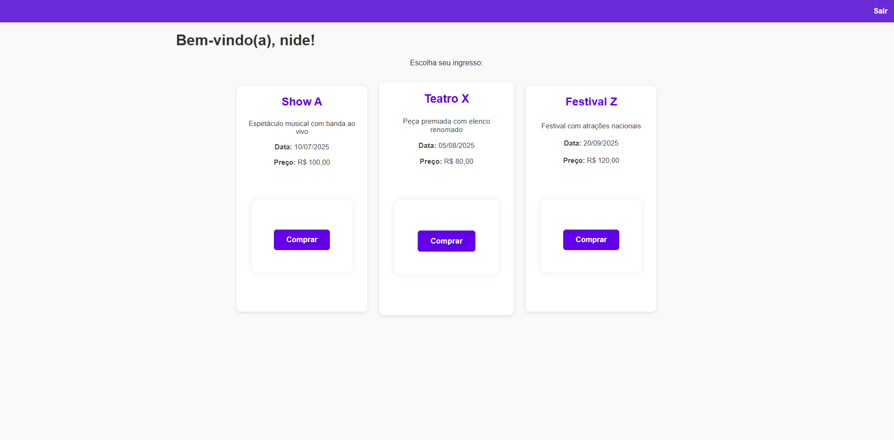
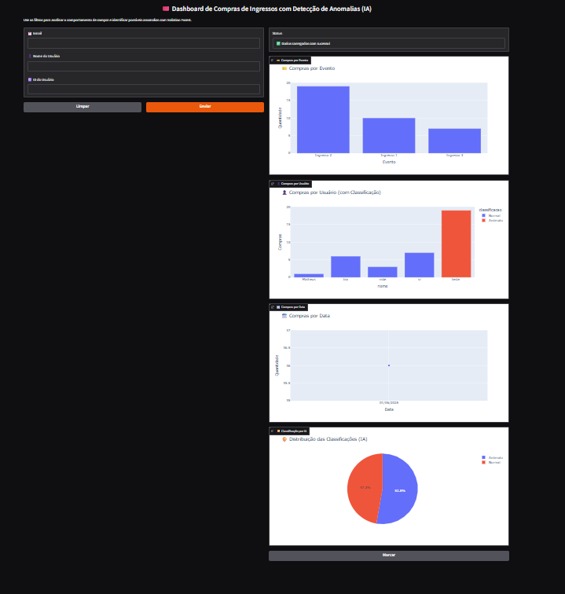
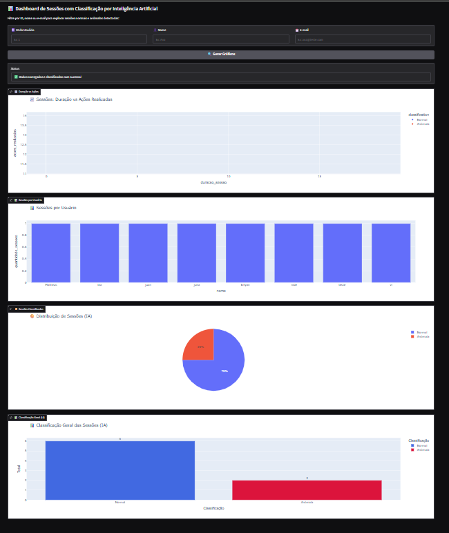
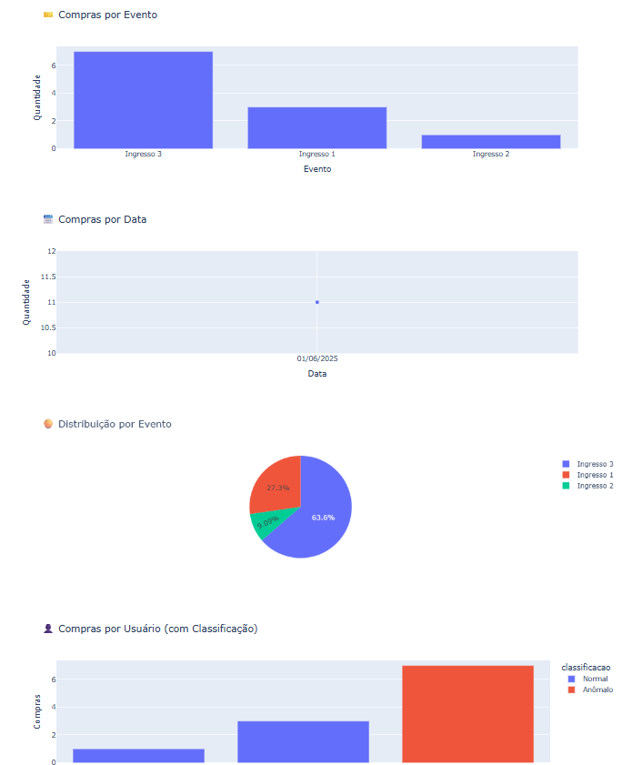
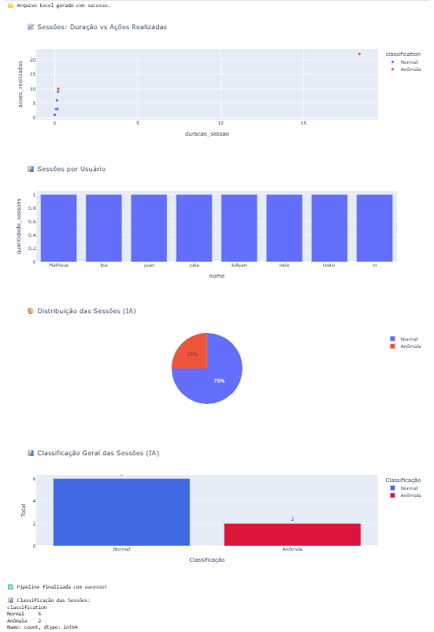

# 

# 🎟️ Ingress-AI: Plataforma de Ingressos com Análise Inteligente

Uma aplicação web para compra de ingressos com dashboards interativos e uso de **Inteligência Artificial** para análise de logs e **detecção de anomalias**, com foco em **melhoria da usabilidade**.

🎓 Este projeto foi desenvolvido como parte da Mostra de Tecnologia da Faculdade, com foco em demonstrar o uso de Inteligência Artificial na melhoria de plataformas web.

---

## 🚀 Tecnologias Utilizadas

- **Python** (Flask, Pandas, Scikit-learn)
- **SQLite3**
- **HTML/CSS** (páginas responsivas)
- **Gradio** (interface interativa de dashboards)
- **Plotly Express** (gráficos interativos)
- **Jupyter Notebook** (pipelines com IA)

---

## 🎯 Objetivos

- Criar uma plataforma de compra de ingressos com autenticação e fluxo real.
- Registrar logs de navegação e compras dos usuários.
- Aplicar **IA (Isolation Forest)** para detectar **comportamentos anômalos**.
- Identificar **possíveis falhas de usabilidade** baseadas nos padrões de uso.
- Exibir os dados de forma **interativa** via dashboards.

---

## 🧠 Inteligência Artificial e Usabilidade

A aplicação utiliza a técnica de IA **Isolation Forest** para analisar logs e sessões, classificando interações como **normais** ou **anômalas**. Esses dados são usados para detectar possíveis problemas de usabilidade na plataforma, como interações frustradas ou falhas no processo de compra.

Além disso, também é feita análise de anomalias nas **compras de ingressos**, identificando comportamentos incomuns que podem indicar erros no processo ou abusos.

---

## 💻 Funcionalidades

- Cadastro e login de usuários.
- Compra de ingressos com datas e preços reais.
- Registro completo de logs por sessão.
- Dashboards interativos para sessões e compras.
- Detecção de anomalias com IA.
- Exportação de dados para CSV e Excel.

---

## 🧪 Execução Local

1. **Crie um ambiente virtual** (recomendado para isolar dependências):  
   - No terminal, dentro da pasta do projeto, execute:  
     ```bash
     python -m venv venv
     ```  
   - Ative o ambiente virtual:  
     - **Windows:**  
       ```bash
       venv\Scripts\activate
       ```  
     - **macOS/Linux:**  
       ```bash
       source venv/bin/activate
       ```

2. **Instale as dependências do projeto:**  
   ```bash
   pip install -r requirements.txt
---

## 📁 Estrutura do Projeto

```
├── app.py                      # Backend Flask
├── database.db                 # Banco de dados SQLite
├── static/                     # Estilos CSS
├── templates/                  # Páginas HTML (login, cadastro, comprar)
├── dashboards_melhorados/      # Notebooks com IA e visualizações
│   ├── dashboard_gradio_ingressos.ipynb
│   └── dashboard_logs_interativo_com_anomalias.ipynb
    ├── pipeline_logs_anomalias_ia_novo.ipynb
│   ├── pipeline_logs_ingressos_atualizado.ipynb
├── imagem/                    # Imagens utilizadas no README
```

---

## 📸 Demonstração Visual

### 💡 Plataforma

- Página inicial 
- 

- Cadastro
- 

 - Login 
- 

- Listagem e compra de ingressos
- 

### 📊 Dashboards com IA
- 
- 

### 📊 Pipelines com IA
- 
- 

---

## 👥 Equipe

| Nome           | GitHub                                           |
|----------------|--------------------------------------------------|
| Vitória Costa  | [@vihsilvadacosta](https://github.com/vihsilvadacosta) |
| Suelen Araujo  | -                     |

---

## 🧠 Disciplinas Envolvidas

- Linguagens Formais e Autômatos
- Estrutura de Dados
- Programação Web
- Banco de Dados

---

## 🏫 Informações Acadêmicas

- **Universidade:** Universidade Braz Cubas  
- **Curso:** Ciência da Computação  
- **Semestre:** 7º  
- **Período:** Noite  
- **Professora orientadora:** Dra. Andréa Ono Sakai  
- **Evento:** Mostra de Tecnologia – 1º Semestre de 2025  
- **Local:** Laboratório 12  
- **Datas:** 05 e 06 de junho de 2025

---

## 📄 Licença

Este projeto foi desenvolvido para fins **acadêmicos** e **educacionais** como parte da Mostra de Tecnologia.

---

## 🙏 Agradecimentos

Agradecemos à equipe docente e à coordenação do curso de Ciência da Computação pelo suporte e incentivo durante o desenvolvimento do projeto.
